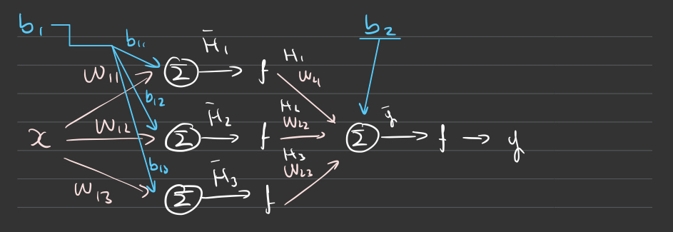
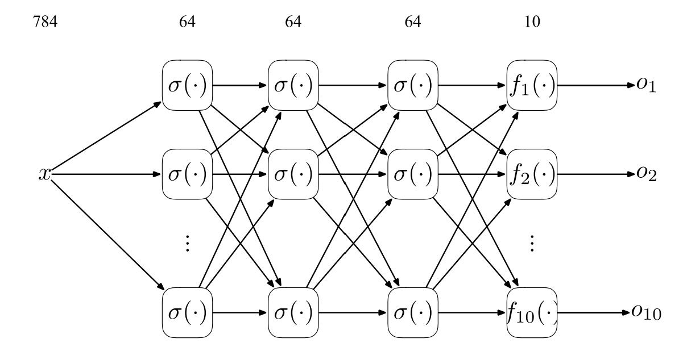
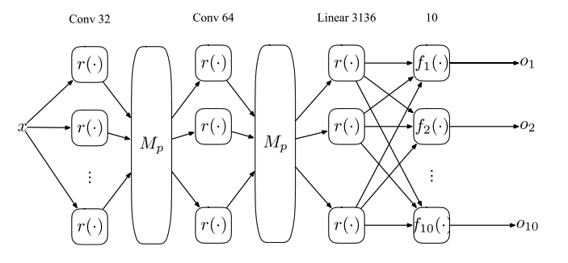

## MLforDesEng

This repository contains notes for the "Machine Learning for Design Engineers" module offered at Imperial College London.
The module is assessed in three categories: two written reports (15%), lab exam (15%), and final exam (70%). In this repo, you'll find my notes for the course as well as an in-depth analysis of each labs to prepare for the lab exam. You can also find the written reports attached.

#### Lab 1 - Building an ANN (Artificial Neural Network) with a sigmoid activation function and backpropagation

1. Understand and code a simple neuron
2. Understand how a neuron learns
3. Understand its limitations

#### Lab 2 - Adding Non-linearity (Hidden layers) to solve XOR problems with softmax activation and cross-entropy loss function

1. Understand Backpropagation (Deriving each partial derivatives)
2. Write a neural network with 1 or more hidden layers
3. Solve the XOR
4. Understand how to build general classifiers

#### Lab 3 - Using PyTorch library to build multiple hidden layers

1. Understand how to use PyTorch to write a neural network
2. Write a neural network with multiple neural networks

#### Lab 4 - Adding convolutional layers to solve CNN (Convolutional Neural Network) problems

1. Write a convolutional network for the MNIST database
